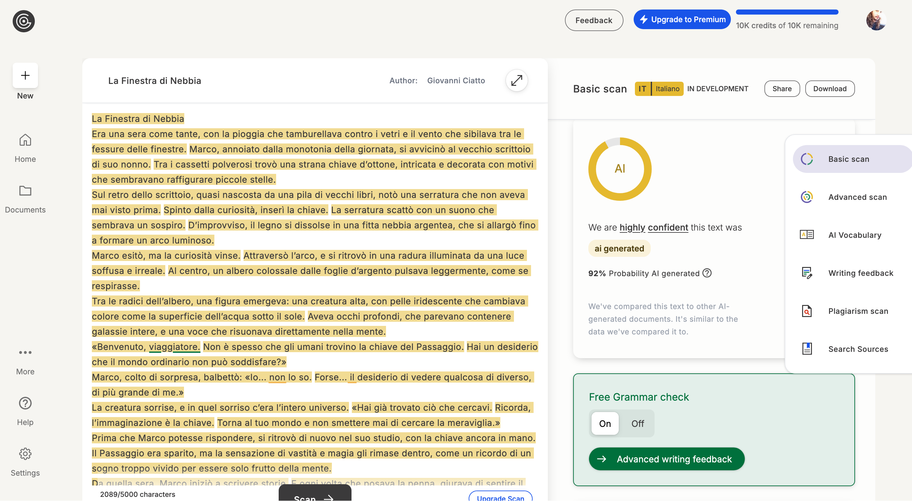

+++

title = "A cosa ci serve l'IA"
description = "Talk divulgativo sull'intelligenza artificiale"
outputs = ["Reveal"]

+++

{}

# A cosa ci serve l'Intelligenza Arificiale?

<span class="hint">(versione presentazione: )</span>

[Giovanni Ciatto](https://www.unibo.it/sitoweb/giovanni.ciatto), Dipartimento di Informatica — Scienza e Ingegneria (DISI), Sede di Cesena,
<br>Alma Mater Studiorum—Università di Bologna


<br>
<span class="hint">Immagine generata con IA (notare l'errore "di battitura")</span>

---

## Link a queste slide

<>


[<i class="fa fa-print" aria-hidden="true"></i> versione stampabile](?print-pdf&pdfSeparateFragments=false)

---

## Scaletta

1. [Nozioni utili](#intro)
2. [Diversi livelli di IA](#levels): [AGI](#agi), [ASI](#asi), [ANI](#ani)
3. [AI vs. Informatica](#ai-vs-cs)
3. [Principali tappe verso l'IA Generativa](#towards-genai)
4. [IA Generativa (GenAI)](#genai)
5. [Principali soluzioni tecnologiche per GenAI](#interfaces)
6. [Principali modalità d'utilizzo di GenAI](#modes)
    - [motore di ricerca](#search-engine), [assistente di (ri)scrittura](#writing), [assistente di lettura](#reading), [assistente per l'elaborazione dei dati](#data-processing), [generatore di contenuti](#content-generation)
7. [Quanto è intelligente l'GenAI?](#how-intelligent)
8. [IA e Società](#society)
    - [lavoro](#work), [ambiente](#environment), [salute](#health), [istruzione](#education), [sicurezza](#security), [difesa](#defense), [giustizia](#law), [etica](#ethics), [informazione](#news), [arte](#arte)

{}

---



## Cosa (non) è l'IA?

<https://duckduckgo.com/?t=h_&q=intelligenza+artificiale&iax=images&ia=images>


(sembrerebbe trattarsi di robot umanoidi)

---

{}

## Sfatiamo alcuni miti

1. L'IA _non_ è __una cosa sola__
    - ci sono varie cose che vengono chiamate IA, molto diverse tra loro

2. _Non_ ci sono (solo / ancora) __robot umanoidi__ _senzienti_ che si comportano come le persone
    - l'IA è spesso invisibile, e non sempre ha bisogno di un corpo
        + es. google translate
        + es. filtri instagram
        + es. NPC dei videogiochi

3. L'IA _non_ è __magica__ né onnipotente
    - molta _matematica_, molta _statistica_, molta _informatica_
    - spesso è molto limitata, e può fare solo quello per cui è stata progettata

---

C'è chi fa ricerca sui _robot_, anche umanoidi, ma __ben che vada__ sanno fare _azioni specifiche_:


{}

---

## Cos'è l'intelligenza __umana__?

{}
Domanda _difficile_, la risposta dipende molto dal __contesto__
{}

{}
Esistono vari __tipi__ di intelligenza _logico-matematica_, verbale-linguistica, _emotiva_, corporeo-cinestetica, ...
{}

<br>

{}
Più facile definire per esempi:
+ intelligenza come capacità di _apprendere_ (dall'esempio, dall'errore, ...)
+ capacità di _adattamento_ (applicare conoscenze a situazioni nuove)
+ [Teoria della Mente](https://it.wikipedia.org/wiki/Teoria_della_mente): capacità di comprendere e _interpretare_ i comportamenti e pensieri _degli altri_
+ __Senso comune__: conoscenza di base su come funziona il mondo fisico (es. "se tocco il fuoco mi scotto") 
{}

---

## Intelligenza vs. Autonomia

> Altra caratteristica degli esseri umani: 
> <br>
> __autonomia__ $\approx$ le persone possono fare ciò che vogliono

"Fare ciò che si vuole" $\approx$ "avere capacità di _scelta_"

<br>

- autonomia __motivazionale__ $\rightarrow$ scelgo che _obiettivi_ pormi
    + es. "voglio comprare l'ultimo gioco di Zelda"
- autonomia __esecutiva__ $\rightarrow$ scelgo _come_ raggiungere gli obiettivi
    + es. "voglio andare al GameStop" vs. "voglio comprare sul Nintendo Store"

{}
> Intelligenza e autonomia sono _intrecciate_:
> <br> per __scegliere__ e __agire__ efficacemente servono molti aspetti dell'intelligenza
{}

---

## Cos'è l'intelligenza __artificiale__?

Una macchina (un computer) che è in grado di:

- _emulare_ una o più abilità tipiche dell'_intelligenza umana_
    + anche abilità scontate per un umano, come _riconoscere_ le cose del mondo fisico
        * __rappresentazione del mondo__

- raggiungere un qualche grado di _autonomia_ 
    * va già bene fermarsi all'autonomia _esecutiva_

---

## Autonomia > Automazione

- __Automazione__: una macchina che svolge la sua funzione senza (troppo) aver bisogno di intervento umano
    + la macchina _non sceglie_ cosa fare e come farlo

- __Autonomia__: la macchina ha _margine di scelta_ su __cosa__ fare e/o __come__

{}
### Esempio:

1. il __condizionatore__: è automatico
2. alcuni __robot aspirapolvere__ hanno margine di autonomia _esecutiva_

<br>




{}

--- 



## Diversi livelli di IA

1. Artificial _narrow_ intelligence (__ANI__, IA _ristretta_): macchine con un compito preciso che svolgono emulando qualche abilità umana
    + noi siamo qui!

2. Artificial _general_ intelligence (__AGI__, IA _generale_): macchine con un grado di intelligenza ed autonomia comparabili a quelle umane
    + lavori in corso, ETA: decenni o secoli

3. Artificial _super_ intelligence (__ASI__, IA _superiore_): macchine con un grado di intelligenza ed autonomia superiori a quelle umane
    * superiori a quelle di _ogni_ essere _umano_? o della _collettività umana_?

---



# AGI — Artificial _General_ Intelligence

Intelligenti _come_ un essere umano

---

## Esempi di AGI nella cinematografia (pt. 1)

Sonny di ["Io Robot"](https://it.wikipedia.org/wiki/Io,_robot_(film))


- corpo umanoide con sembianze robotiche
- iper-razionale
- dotato di "libero-arbitrio"
- si riscopre emotivo nell'arco narrativo

---

## Esempi di AGI nella cinematografia (pt. 2)

Dolores Abernathy di ["Westworld"](https://en.wikipedia.org/wiki/Westworld_(TV_series))


- corpo umanoide con sembianze umane
- iper-emotiva
- guadagna autocoscienza e quindi libero arbitrio nell'arco narrativo
    * maturando, attraversa vari stadi emotivi: vendicativa, compassionevole, etc.
- in Westworld, la coscienza sta in una piccola pallina nel cranio
    * può essere trasferita in altri corpi, o copiata

---

## Esempi di AGI nella cinematografia (pt. 3)

[J.A.R.V.I.S.](https://it.wikipedia.org/wiki/J.A.R.V.I.S.) di IronMan



<br>

- nessun corpo: è un'entità virtuale
- iper-razionale
- inizialmente un mero assistente, fa poi delle scelte autonome che impattano la trama
- accesso completo a Internet
- capacità di guadagnare il controllo di altre macchine

---



# ASI — Artificial _Super_ Intelligence

_Più_ intelligente degli esseri umani

---

## Esempi di ASI nella cinematografia (pt. 1)

[Skynet](https://en.wikipedia.org/wiki/Skynet_(Terminator)) di Terminator

{}
{}

{}
{}
- nessun corpo: è un'entità virtuale
- iper-razionale
- quando raggiunge la auto-consapevolezza
    1. decide che gli umani sono una minaccia
    2. scatena un olocausto nucleare come attacco preventivo
- capacità di ottenere il controllo di altre macchine
{}
{}


---

## Esempi di ASI nella cinematografia (pt. 2)

L'IA di [Matrix](https://it.wikipedia.org/wiki/Matrix) (da non confondersi col solo Mr. Smith)



<br>

- non si capisce se IA sono un'entità collettiva o tante entità invididuali
- le IA si sono ribellate agli umani:
    1. gli umani hanno oscurato il cielo per togliere energia alle macchine
    2. le macchine hanno iniziato ad attingere energia dagli umani coltivati
- le macchine hanno la capacità di costruirsi e (ri)progettarsi da sole

---

## Esempi di ASI nella cinematografia (pt. 3)

Rehoboam di [Westworld 3](https://it.wikipedia.org/wiki/Episodi_di_Westworld_-_Dove_tutto_%C3%A8_concesso_(terza_stagione))



<br>

- un supercomputer di dimensione sferica
- accesso ai dati personali di tutte le persone, e non solo
- iper-razionale
- capace di prevedere il prevedere il futuro degli individui e della società
    + capace si simulare scenari e prendere decisioni per evitare quelli negativi

---

## Esempi di ASI nella cinematografia (pt. 4)

"Il direttore" di [Travelers](https://it.wikipedia.org/wiki/Travelers)



<br>

- un computer quantistico, di forma cilindrica
- accesso ai dati disponibili in rete
- capace di simulare scenari alternativi nel passato, e il loro impatto sul presente

---



# ANI — Artificial _Narrow_ Intelligence

Intelligente (veloce) ma _senza autonomia_

---

## Esempi di ANI dalla vita reale (pt. 1)

Traduzione automatica _di testo_ — Es. [Google Translate](https://translate.google.it/?hl=it&sl=it&tl=en) 



<br>

- include anche _Text-to-Speech_ (generazione di audio "parlato" da testo)

---

## Esempi di ANI dalla vita reale (pt. 2)

Traduzione automatica _di immagini_ — Es. [Google Translate](https://translate.google.it/?sl=en&tl=it&op=images) 



<br>

- include capacità di _riconoscimento_ e _localizzazione_ di testo in immagini
- include capacità di _traduzione_ di testo in immagini
- include capacità di _disporre_ il testo tradotto in modo simile all'originale

---

## Esempi di ANI dalla vita reale (pt. 3)

"Filtri" dei social network — Es. [Instagram](https://www.instagram.com/)



<br>

- include capacità di _riconoscere la posa_ e _l'orientamento_ del viso
- include capacità di _modificare_ immagini predefinite e orientarle rispetto al viso

---

## Esempi di ANI dalla vita reale (pt. 4)

Riconoscimento di immagini — Es. analisi del traffico





- include capacità di _riconoscere_ e _localizzare_ oggetti in immagini
- sembra una IA "unica", ma in realtà ogni IA è specializzata su un gruppo di oggetti
- utile per _analisi_ del traffico, _monitoraggio_ di eventi, etc.

---

## Esempi di ANI dalla vita reale (pt. 5)

Riconoscimento di immagini — Es. autenticazione con volto



<br>

- diverso dalla precedente: bisogna _distringuere_ un volto dagli altri
    * più complesso del semplice trovare un volto in una foto
- utile per _autenticazione_ e _controllo_ accessi
    * in realtà relativamente _insicuro_ per questo scopo

---

## Esempi di ANI dalla vita reale (pt. 6)

Riconoscimento di immagini — Es. di impronte digitali



<br>

- riconosce _solo_ impronte digitali, e le _distingue_ tra loro
- sapendo che l'immagine è un'impronta, si può aumentare la precisione del riconoscimento, sfruttando le _minuzione tipiche_
- utile per _autenticazione_ e _controllo_ accessi
    * più sicuro del riconoscimento facciale, meno della password

---

## Esempi di ANI dalla vita reale (pt. 7)

Riconoscimento di immagini — Es. di caratteri scritti a mano


[esempio interattivo qui](https://shapecatcher.com/)

<br>

- molto difficile riconoscere _intero testo_ scritto a mano
    - più facile riconoscere _singoli caratteri_
- utile per automazione di _operazioni postali_, o di elaborazione di _moduli standardizzati_

---

## Esempi di ANI dalla vita reale (pt. 8)

Calcolo di percorsi — Es. [Google Maps](https://www.google.it/maps)



<br>

- attività molto consolidata, ma è tra i primi esempi di IA nei libri di testo
- include capacità di _calcolare_ il percorso migliore tra due punti
    + magari considerando _traffico_, pedaggi, etc.

---

## Esempi di ANI dalla vita reale (pt. 9)

Calcolo di percorsi — Es. _Movimento_ dei _personaggi_ nei _videogiochi_


[esempio interattivo qui](https://amarillion.github.io/helixgraph/examples/d3/)

<br>

- utile per far muovere i personaggi dei videogiochi in modo _realistico_ verso una destinazione
- l'idea di fondo, è la stessa di Google Maps, ma in uno spazio diverso

---

## Esempi di ANI dalla vita reale (pt. 10)

Riconoscimento di _suoni_ — Es. [Shazam](https://www.shazam.com/)



<br>

- riconosce canzoni e brani musicali da brevi estratti audio

---

## Esempi di ANI dalla vita reale (pt. 11)

Riconoscimento di _suoni_ — Es. Speech-to-Text (STT), Riconoscimento del parlato

[(esempio interattivo qui)](https://dictation.io/speech)


<br>

- _converte_ parlato in testo scritto e digitalizzato
- utile in combinazione TTS (Text-to-Speech) per creare _assistenti vocali_

---

## Cosa hanno in comune questi esempi?

> __Automazione__ $\approx$ si ottiene un _servizio_ senza bisogno di intervento umano

{}
### Vantaggi diretti: 
+ __velocità__: le macchine sono più rapide degli umani nella maggior parte dei casi
+ __costo__: le macchine non fanno fatica, non si stancano, non hanno bisogno di stipendio
    * alcuni servizi di IA hanno un prezzo che copre costi di _sviluppo/esercizio_ e _profitto_ del fornitore 
+ __precisione__: su compiti ripetitivi, le macchine sono più precise degli umani
    * in generale, l'errore è controllabile $\implies$ compromesso tra _precisione_ e _velocità_
+ __disponibilità__: le macchine non hanno orari d'ufficio, non si ammalano, non vanno in ferie
+ __riproducibilità__: una volta compreso come automatizzare una attività, tutti possono beneficiarne
{}

{}
### Vantaggi indiretti:
+ le macchine abbattono _tempi e costi_ di _fruizione_ dei servizi che automatizzano
    * es. una volta per tradurre un documento serviva un traduttore umano
+ _migliorano_ le nostre _vite_ in tante piccole cose
    * es. non serve più conoscere i nomi delle vie, basta _"condividere la posizione"_ 
+ ci sollevano da attività _lavorative_ monotone e _ripetitive_
{}

--- 



## IA vs. Informatica

- Questi vantaggi sono veri per qualunque avanzamento tecnico comporti _automazione_

- Molte _tecnologie informatiche_ introducono automazione __senza IA__

- Esempi:
    * _Social networks_ e app di _messaggistica_: automatizzano, velocizzano, e rendono asincrona la _comunicazione_ tra persone
    * Ebay, Amazon, e altri _Negozi On-line_: automatizzano e velocizzano la _compravendita_ di beni
    * Netflix, Prime Video, e altri servizi di _Entertainement Online_: rendono la _fruizione_ di audiovisi automatica e personalizzata
    * YouTube, Vimeo, e altri servizi di _Video Sharing_: automatizzano la _pubblicazione_ di audiovisivi
    * Uber, Lime, e altri servizi di _Car Sharing_: incrociano domanda e offerta di servizi di _mobilità_, automaticamente
    * etc.

{}
> In realtà l'IA può essere applicata in questi ambiti, ma solo per _efficientizzare_ il servizio
{}

---

## Cos'è l'informatica?

{}
{}

{}
{}
- Il _computer_ **transforma** _dati_ di _input_ in dati di _output_
    + **dati** $\approx$ informazioni interessanti e _digitali_
    + es. input: `partenza=Cesena, destinazione=Bologna`
    + es. output: _percorso stradale più veloce_

- Durante la trasformazione, il computer potrebbe:
    + _memorizzare_ informazioni / recuperarne di _memorizzate_
    + _interagire_ sulla rete con altri computer o persone

- Come fa a sapere _cosa fare_? 
    + il computer _esegue_ un __programma__ 
        * $\approx$ _ricetta_, lista di _istruzioni_, per eseguire una _trasformazione_

- Ogni trasformazione input—output risolve un __problema__ interessante
    + es. calcolo del percorso
    + es. visualizzazione di una pagina Web
    + es. riproduzione di un video

- I programmi sono _scritti_ da __persone__ esperte
    + __informatica__ studia come _programmare_ problemi interessanti/_ricorrenti_
{}
{}

---

## L'apprendimento automatico

- Ci sono dei problemi per cui è _difficile_ / impratico scrivere un programma
    + es., in genere, il _riconoscimento_ di immagini, audio
    + es., es. il _riconoscimento_ di scrittura "a mano"

- È _difficile_ dare _istruzioni precise_ su come risolvere il problema
    + perchè il problema stesso è _impreciso_ per sua natura


---

> __Soluzione__: scrivere un programma che possa __imparare__ a _migliorare_ il suo stesso funzionamento
+ questa è la base dell'__apprendimento automatico__, una delle branche più importanti dell'IA come scienza

{}
### Osservazioni

1. Apprendere $\approx$ _migliorare_ (__non__ cambiare) il funzionamento di base di un programma
    + se progettato per distinguere _mele_ da _pere_, non imparerà mai (da solo) a riconoscere _pesche_

2. Le persone imparano _da altre persone_
    + _da chi_ o _cosa_ apprendono le macchine?
{}

---

## Apprendimento da __Esempi__



<br>

1. __Allenamento__: gli umani forniscono _molti_ esempi _noti_ delle cose da riconoscere, la macchina impara da essi
    + es. _foto_ di vari animali e rispettivi _nomi_

2. __Risultato__: la macchina allenata sa riconoscere esempi anche _mai visti prima_
    + es. _nuova_ foto di un animale _noto_, la macchina dice il suo _nome_
    + __NB:__ la macchina _non_ saprà comunque riconoscere _nuovi tipi_ di animali

<!-- https://www.youtube.com/watch?v=9tLCFbupeOI -->

---

## Apprendimento per __Rinforzo__



<br>

- __Allenamento__: la macchina riceve un _premio_ quando fa _bene_ e una _penalità_ quando fa male
    + impara cosa è opportuno fare quando
        * es. "per spegnere il _fuoco_, devo _prima_ prendere l'_acqua_"

- __Risultato__: la macchina sa _cosa_ fare in _situazioni_ simili a quelle dell'allenamento
    + __NB:__ funziona bene per operazioni dove le _azioni_ e _casistiche_ possibili sono _limitate_
        * es. _video-giochi_, automazione industriale, etc.

<!-- https://youtube.com/shorts/MUB-hFilF8o?si=w1u_U65YgxVOiJnq -->

---



# IA Generativa

---

## Verso l'IA Generativa

### Alcuni grandi avanzamenti si sono verificati negli ultimi __10 anni__

<br>

1. \[~2010\] __Deep Learning__ (apprendimento profondo): ritorno in auge di tecniche basate su _reti neurali_
    + maggiore flessibilità e potenza per _apprendimento automatico_ volto al _riconoscimento_
    + ispirate al funzionamento del _cervello umano_

    

---

## Verso l'IA Generativa

### Alcuni grandi avanzamenti si sono verificati negli ultimi __10 anni__

<br>

2. \[~2015\] __Generative Adversarial Networks__ (GAN, reti generative avversarie): capacità di _generare_ contenuti _realistici_
    + es. <https://thispersondoesnotexist.com/>
    

(esempio di GAN che genera volti umani realistici)

---

## Verso l'IA Generativa

### Alcuni grandi avanzamenti si sono verificati negli ultimi __10 anni__

<br>

2. \[~2015\] sempre relativamente alle __GAN__: capacità di _variare lo stile_ di un contenuto
    + es. implica capacità di _apprendere_ lo _stile_ di un'immagine e _applicarlo_ ad un'altra
    + __NB__: il concetto di stile NON è esplicitamente definito, è una cosa _intuitiva_ che le GAN imparano a riconoscere e riprodurre


(esempio di GAN che applica stili artistici diversi ad una stessa immagine)

---

{}

## Verso l'IA Generativa

### Alcuni grandi avanzamenti si sono verificati negli ultimi __10 anni__

<br>

2. \[~2015\] sempre relativamente alle __GAN__: capacità di _modificare_ un contenuto sull'esempio di un altro
    + es. riprodurre la _posa_ di un volto con un _altro volto_
        * __NB__: di nuovo, si evita di dover _definire_ cosa sia una _posa_, la macchina impara da sola
    + es. _deep-fakes_: <https://www.youtube.com/watch?v=koYcqsebFDE>


(esempio di GAN che modifica la posa di un volto)

---

## Verso l'IA Generativa

### Alcuni grandi avanzamenti si sono verificati negli ultimi __10 anni__

3. \[~2020\] __Modelli fondazionali__: grosse _reti neurali_ che imparano ad _elaborare_, _"capire"_, e _produrre_ contenuti
    + contenuti $\approx$ _testo_, _immagini_, _suoni_, etc.
    + allenati su _grandi_ quantità di dati, e con _grandi_ risorse computazionali, a __fare un po' tutto__
        - con l'idea di poterli poi specializzare per _compiti specifici_


---



## Verso l'IA Generativa

### Alcuni grandi avanzamenti si sono verificati negli ultimi __10 anni__

<br>

4. \[2023\] __ChatGPT__ e altre tecnologie note come __large language models__ (LLM) aperte al _pubblico generale_
    + <https://chatgpt.com/>, <https://copilot.microsoft.com/>

<br/>


<br/>


{}

---

## __Terminologia__: Modelli Fondazionali vs. _Large Language Models_



---

{}

## GenAI con modello di consumo _as-a-Service_



---

## GenAI con modello di consumo _as-a-Service_

- Modelli di __costo__:
    + ad __abbonamento__: si paga un _canone_ fisso mensile/annuale per avere accesso al servizio
        * spesso contiene comunque _limiti_ di consumo
    + a __consumo__: si paga in _proporzione_ all'uso effettivo del servizio

- __Consumo__ è misurato in base allo _sforzo computazionale_ necessario per servire la richiesta:
    + _token_ processati (per testo)
    + quantità di _richieste_ effettuate per unità di tempo (minto, ore, giorno, mese)
    + _dimensione_ dei dati processati (per immagini, audio, video)
    + _complessità_ dello specifico _modello_ impiegato per per servire la richiesta

- La __generazione__ da considerarsi un processo _stocastico_, per costruzione

{}
> - La __qualità__ del servizio è soggetta a casualità e a _fluttuazioni_ dovute a:
>    + _carico_ del servizio
>    + scelta del modello, e relativo _aggiornamento_
>    + _limiti_ di servizio eventualumente raggiunti nel _quanto di tempo_ corrente
>    + caso
{}

{}

---

{}

## Ciclo di _apprendimento_ di GenAI



---

## Ciclo di _apprendimento_ di GenAI — __Conseguenze__ (pt. 1)

- __Bias__ di __campionamento__: GenAI conosce _solo_ ciò su cui è stato _allenato_ + pia speranza che impari a _generalizzare_

- L'apprendimento usa dati presi __dal Web__ + eventuali __dati aziendali__ del fornitore del servizio
    + comprovato impiego delle _interazioni_ degli utenti precedenti come _feedback_ per allenamenti successivi

{}
##

> - Informazioni di __nicchia__ possono <u>non</u> essere apprese correttamente (o affatto)
> - Fondamentale __evitare di convididere__ informazioni _sensibili_, _confidenziali_, o protette da _diritti d'autore_
{}

---

## Ciclo di _apprendimento_ di GenAI — __Conseguenze__ (pt. 2)

- Cicli di apprendimento estramente __costosi__ in termini di _denaro_ e _risorse computazionali_...

- ... eseguiti __periodicamente__ (settimane? mesi?) per migliorare la _qualità_ del servizio
    + il modello di consumo _as-a-Service_ permette all'utente di avere accesso traspente al servizio _aggiornato_


{}
##

> - Informazioni __recenti__ potrebbero <u>non</u> essere state (ancora) _apprese_
> - Rischio di ricevere risposte __datate__ o _manchevoli_ da GenAI
> - GenAI dà l'_impressione_ di star imparando __durante la conversazione__, ma in realtà lo fa _offline_
{}

---

## Alcune soluzioni tecnologiche permettono di _scegliere_ (pt. 1)


<br/>


---

## Alcune soluzioni tecnologiche permettono di _scegliere_ (pt. 2)


<br/>


---

## Alcune soluzioni tecnologiche permettono di _scegliere_ (pt. 3)


<br/>


---

## Alcune soluzioni tecnologiche permettono di _scegliere_ (pt. 4)


<br/>


{}

---

## Funzionamento di base di un LLM


- Gli LLM hanno imparato a __indovinare__ la _parola_ successiva in un _testo_ dato il _contesto_ precedente
    * simile alla tastiera _predittiva_ del cellulare, ma molto più _complessa_ e _potente_
- In altre parole, gli LLM hanno appreso come usare il __linguaggio naturale__

---

## Linguaggio e Ragionamento

- Il __linguaggio naturale__ aiuta le persone a _comunicare_

- Può essere usato per esprimere concetti _complessi_ o _astratti_

- Può essere usato per _ragionare_ su _problemi_ e _soluzioni_
    - tuttavia ammette __imprecisioni__, dovuti ad _ambiguità_, interpretazioni variabili, soggettività, etc.


> Il linugaggio naturale permette agli LLM di usare __l'intuito__ nei _ragionamenti_, come gli umani
> <br> (quindi di __sbagliare__ come gli umani)
- $\implies$ gli LLM possono risultare molto sicuri di sé, pur dicendo cose _sbagliate_, _imprecise_, o _inventate_

---

## Esempio: Parole inventate

Visitate il sito: [https://www.thisworddoesnotexist.com/](https://www-thisworddoesnotexist-com.translate.goog/?_x_tr_sl=en&_x_tr_tl=it&_x_tr_hl=it&_x_tr_pto=wapp)

genera parole _inventate_ che sembrano _reali_, ad esempio:



---



# Principali soluzioni __tecnologiche__

## Categorizzate per tipo di __interfaccia__

- _Conversazionali_: e.g. [ChatGPT](https://chatgpt.com/), [Claude](https://claude.ai/login?returnTo=%2F%3F), [Scite](https://scite.ai)
- _Auto-completamento_: e.g. [GitHub Copilot](https://github.com/features/copilot)
- _Programmatiche_: e.g. [OpenAI Platform](https://openai.com/api/), [Hugging Face](https://huggingface.co/)
- _In-App_: e.g. [Microsoft 365 Copilot](https://www.microsoft.com/it-it/microsoft-365/copilot?market=it)
- _Editing di audio-visivi_: e.g. [Suno](https://suno.com/), [Runway](https://runwayml.com/)
- _Ispezione di materiale generato_: e.g. [GPTZero](https://gptzero.me/), [ZeroGPT](https://www.zerogpt.com/)

{}Lista non esaustiva!{}

---

## Interfaccia __conversazionale__

{}
{}


{}
{}
<br>

- Interazione _testuale_ che mima una _corrispondenza_ (__chat__)
    + l'utente chiede, l'IA risponde _reattivamente_
- L'interfaccia permette l'inserimento di un __prompt__
    + opzionalmente contenente _allegati_ (e.g. immagini, documenti)
- Le risposte sono __contestuali__
    + i.e., lo _storico_ della conversazione impatta le risposte _future_
- La risposta contiene __testo__ (spesso _formattato_)
    + opzionalmente: _immagini_, URL, codice

{}

### Talvolta...

- ... prima di rispondere, l'IA fa una __ricerca__ su _Web_
- importante per avere risultati _aggiornati_

{}

{}
{}

---

## Interfaccia basata su __auto-completamento__

{}
{}


{}
{}
<br>

- L'IA _suggerisce_ un __completamento__ per il testo inserito
    + e.g., codice, testo, URL
- L'utente __accetta__ (anche in parte) o _ignora_ il suggerimento
- Usato anche e soprattutto per __codice__ di _programmazione_

{}

### Attenzione...
- ... modello di costo ad __abbonamento__ (vedi [qui](https://github.com/features/copilot/plans))
- ... potenziali __leak__ di informazioni _sensibili_
- ... rischio di __lock-in__ non trascurabile

{}

{}
{}

---

## Interfaccia __programmatica__

{}
{}

```python
import asyncio
from openai import AsyncOpenAI

client = AsyncOpenAI(api_key="sk-1234567890abcdef1234567890abcdef")

async def main():
    stream = await client.chat.completions.create(
        model="gpt-4",
        messages=[
            dict(role="user",
                 content="European countries, one by line")
        ],
        stream=True,
    )
    async for chunk in stream:
        print(chunk.choices[0].delta.content or "", end=", ")

asyncio.run(main())
```

Output:
```plaintext
Albania, Andorra, Austria, Belarus, Belgium, Bosnia and Herzegovina, Bulgaria, Croatia, Cyprus, Czech Republic, Denmark, Estonia, Finland, France, Germany, Greece, Hungary, Iceland, Ireland, Italy, Kosovo, Latvia, Liechtenstein, Lithuania, Luxembourg, Malta, Moldova, Monaco, Montenegro, Netherlands, North Macedonia, Norway, Poland, Portugal, Romania, Russia, San Marino, Serbia, Slovakia, Slovenia, Spain, Sweden, Switzerland, Turkey, Ukraine, United Kingdom, Vatican City (Holy See),
```
{}
{}

- __Linguaggio di programmazione__ che interagisce con IA
    + e.g., _Python_, JavaScript

- L'interazione rimane di tipo _richiesta-risposta_
    + il __programma__ invia una _richiesta_, l'IA _risponde_

{}

### Abilitante per

- Prompt __parametrici__, risposte processate _automaticamente_
    + es. `list of LOCALITIES in AREA, one by line`
        + dove `LOCALITIES` $\in$ {`cities`, `regions`, `states`}
        + e `AREA` $\in$ {`Europe`, `Asia`, `Africa`, `America`, `Oceania`}
        + risultati _ordinati alfabeticamente_

- Scrittura __software__ che usa l'IA come __servizio__
    + utile in _industria_ come in _ricerca_

{}

{}

### Attenzione...
- ... modello di costo __a consumo__ (vedi [qui](https://openai.com/api/pricing/))
    + proporzionale al numero di _token_ processati
    + prezzi variabili _per modello_

{}

{}
{}

---

## Interfaccia __in-app__

{}
{}


{}
{}
<br>

- GenAI integrata in __applicazioni__ _desktop_ o _web_
    + e.g., _Microsoft Office_ (Word, Excel, Outlook)

- supporto per interfaccia __conversazionale__ _interna_
    + conversazione intrinsecamente _contestualizzata_

- IA __automatizza__ _operazioni complesse_ (interne all'app)
    + e.g., _scrittura_ di bozze
    + e.g., _generazione_ di formule, grafici

{}

### Attenzione...
- ... modello di costo ad __abbonamento__ (vedi [qui](https://www.microsoft.com/it-it/microsoft-365/copilot?market=it#plans))
- ... potenziali __leak__ di informazioni _sensibili_
- ... rischio di __lock-in__ non trascurabile

{}

{}
{}

---

## Interfaccia per __editing__ di audio-visivi (e.g. _musica_)

{}
{}


{}
{}
- Interazione __one-shot__ per generare il contenuto
    + _input_: descrizione testuale del contenuto
    + _output_: contenuto

- L'interfaccia permette poi
    + _riproduzione_ del contenuto
    + __modifica__ del contenuto
        + e.g., _taglio_ di parti, _modifica_ di tonalità

{}

### Esempio

- ["Canzona di Bacco" (Lorenzo il Magnifico, 1490)](https://it.wikipedia.org/wiki/Il_trionfo_di_Bacco_e_Arianna_(poesia)), rock
    + <https://suno.com/song/cce33ee7-a581-47ae-b9d1-806902e88e47>

{}
{}
{}

---

## Identificazione di contenuti generati



- __Non__ basato su _GenAI_, specializzato su _testo_
- Fornisce una _percentuale di confidenza_ che il contenuto sia generato
    + facilmente aggirabile _fornendo scaletta_ a GenAI, o applicando _modifiche manuali_ testo 

---



# Principali __modalità d'utilizzo__

## Categorizzate per __ruolo di GenAI__

### GenAI come...

* ... _motore di ricerca_: uso GenAI per __ricercare__ informazioni
* ... _assistente di (ri)scrittura_: uso GenAI per __(ri)scrivere__ documenti
* ... _assistente di lettura_: uso GenAI per __acquisire informazioni__ da documenti
* ... _assistente per l'elaborazione dei dati_: uso GenAI per __elaborare__ dati
* ... _generatore di contenuti_: uso GenAI per __creare__ contenuti

{}Lista non esaustiva!{}

---

{}



## GenAI come _motore di ricerca_

### Disclaimer

> GenAI __non è__ un _motore di ricerca_ come Google, Bing, DuckDuckGo, etc.

{}

- FM, di base, __non accedono__ al Web (__né interrogano__ qualche sorgente) prima di rispondere
    * alcune tecnologie specifiche possono farlo, ma non c'è garanzia

- FM, di base, rispondono in base a _dati_ e _conoscenze_ acquisite durante __l'allenamento__
    * informazioni _successive_ all'ultimo ciclo di apprendimento potrebbero non essere considerate

- FM possono essere immaginati come __grandi memorie__
    * in cui (porzioni de) lo _scibile umano_ è stato _"registrato"_
    * interrogabili tramite il _linguaggio naturale_

- Le risposte di GenAI non vanno _mai_ accettate __acriticamente__, in quanto suscettibili di _allucinazioni_:
    * __errori__: informazioni fattualmente false o inventate, riportate con sicumera
    * __fraitendimenti__: informazioni fuori contesto o non pertinenti rispetto all'aspettativa dell'utente
    * __bias__: di campionamento delle informazioni, di selezione del motore di ricerca, intrinseci nel linguaggio, etc.

{}

---

## GenAI come _motore di ricerca_

### Razionale

<br>

Possiamo considerare FM come __esperti__ su tematiche che:
* siano temporalmente _consolidate_ $\implies$ diffidare di risposte su temi _recenti_
* siano relativamente _popolari_ $\implies$ diffidare di risposte su temi _di nicchia_

---

## GenAI come _motore di ricerca_

### Consigli sempre validi

<br>

* verificare le __fonti__ menzionate da GenAI
   - esistono davvero? sono aggiornate?

* verificare l'__aderenza__ alle fonti
    - la fonte dice davvero quello che GenAI ha riportato?

* prediligere, se possibile, la __lingua inglese__
    - LLM sono stati sicuramente _esposti_ a più testi _inglesi_ che italiani durante l'_allenamento_

{}

---

{}



## GenAI come _assistente di (ri)scrittura_

### Razionale

<br>

- __Interrogare__ GenAI per generare testo da riusare __verbatim__ è un approccio {}naïf{}
    + ci si affida in toto a GenAI, col rischio che sfuggano {}allucinazioni{}
    + si rischia di ereditare {}bias{} ed {}errori semantici{} senza accorgersene

{}

> - Approccio più _furbo_: chiedere a GenAI di __rielaborare__ un testo grezzo o _parziale_
>    + es. una lista di _cose da dire_, argomenti da trattare, etc.
>    + _controllo_ e _responsabilità_ del __filo del discorso__ rimangono sull'utente

{}

---

## GenAI come _assistente di (ri)scrittura_

### Consigli sempre validi

<br>

* tenere il _controllo_ di __cosa__ si vuole dire nel testo
* farsi _assistere_ riguardo alla __forma__ del testo
* __rivedere__ il testo prodotto per _errori_, _incongruenze_, _allucinazioni_
    + chiedere opportunamente _variazioni_ fino a soddisfazione
* __rivedere__ eventuali _riferimenti_ a _fonti_ o _citazioni_ per _aderenza_
* chiedersi se non ci sia __mancanza__ di _informazioni_ o _riferimenti_ importanti

---

### Altri tipi di supporto alla scrittura

## Supporto alla _traduzione automatica_ (pt. 1)

> Meglio strumenti consolidati (e.g. __Google Translate__) o _modelli fondazionali_ (e.g. __GPT__)?

(posto che la traduzione fatta da esperti _umani_ sarà sempre _migliore_)

---

### Altri tipi di supporto alla scrittura

## Supporto alla _traduzione automatica_ (pt. 3)


<br>

__TL;DR:__ Google Translate è _preferibile_ laddove sia richiesta _precisione_

---

### Altri tipi di supporto alla scrittura

## Supporto alla _traduzione automatica_ (pt. 4)



<br>

__TL;DR:__ GPT _usabile_ laddove il __contesto__ possa aiutare la traduzione

---

### Altri tipi di supporto alla scrittura

## Supporto alla _traduzione automatica_ (pt. 5)

{}
{}

{}
{}
- Richiesta di _transposizione_ in lingua con uno __stile specifico__
- Utile per migliorare la _qualità_ scrittura _in lingua_
{}
{}

---

### Altri tipi di supporto alla scrittura

## Supporto alla _generazione di codice_ di programmazione



(codice suggerito __inefficiente__, ma _funzionante_)

---

### Altri tipi di supporto alla scrittura

## Supporto alla _documentazione del codice_ di programmazione



(spiegazione __corretta__ ed articolata)

{}

---

{}



## GenAI come _assistente di lettura_

### Razionale

<br>

- GenAI può essere usato per _acquisire_ informazioni da __documenti testuali__ [senza leggerli integralmente]
    + e.g., _estrarre highlights_ da un testo, _sintetizzare_ un testo, etc.

- La stessa idea si può applicare a __contenuti multimediali__
    + e.g., _estrarre highlights_ da un video, _trascrivere_ un audio, etc.

{}

> Il testo [o contenuto] da cui estrarre informazioni __deve essere fornito__ dall'_utente_
- _Non presumere_ che GenAI conosca il testo [o contenuto] in questione

{}

---

## GenAI come _assistente di lettura_

### Consigli sempre validi

- Al crescere della _lunghezza_ del testo, aumenta la probabilità di __allucinazioni__
    + idem per _durata_ dei contenuti multimediali

- __Verificiare__ che il testo [o contenuto] fornito _non_ contenga _informazioni_ __sensibili__ o __riservate__

- __Verificare__ di avere il _diritto_ di fornire a _terzi_ [copie de] il contenuto

- Tenere presente la possibilità di inevitabili __distorsioni__
    + _allucinazioni_ $\rightarrow$ l'estrazione potrebbe inventare informazioni non presenti nell'originale
    + _lacune_ $\rightarrow$ elementi importanti portebbero non essere estratti


{}

---

{}



## GenAI come assistente per _l'elaborazione dei dati_

### Razionale

<br>

- GenAI può essere usato per __elaborare dati__, anche _strutturati_, _semi-strutturati_, o _non strutturati_
    + e.g., _tabelle_, _dataset_, etc.

- Vari __tipi di elaborazione__ possibili, es:
    - (semplicifi) operazioni di _aggregazione_ o _filtraggio_ di dati
    - _visualizzazione_ dei dati
    - creazione di (semplici) modelli _predittivi_
    - _generazione_ di dati _sintetici_

- Si istruisce GenAI ad operare come un __analista dati__ o un __data scientist__
    + fornendo i _dati_ e le operazioni da _eseguire_, valutando i _risultati_

---

## GenAI come assistente per _l'elaborazione dei dati_

### Disclaimer

<br>

- _LLM_, di per loro, sono __imprecisi__ e _non affidabili_ per il calcolo e l'_analisi di dati_
    + specie al crescere del volume dei dati

- Tuttavia, _FM_ posssono generare __codice di programmazione__ (dietro le quinte) per _elaborare_ i dati
    + _compensando_ quindi la _limitata_ capacità di analisi dei LLM

---

## GenAI come assistente per _l'elaborazione dei dati_

### Consigli sempre validi

<br>

- Prima di caricare dati, __verificare__ che non contengano _informazioni sensibili_ o _riservate_, e di avere il _diritto_ di fornirli a _terzi_
    + _escludere_ i dati dai futuri cicli di allenamento

- Fare richieste _precise_, _chiare_, e _possibili_ (rispetto ai dati forniti)
    + riguardanti operazioni che _in linea di principio_ __comprendi__ e che __potresti fare senza GenAI__

- __Non fidarsi ciecamente__ dei risultati, _verificare_ che siano _corretti_
    + specie laddove siano svolti _calcoli_ su dati _numerici_

- Chiedere il __codice sorgente__ delle operazioni svolte, per _verificarle_, e renderle __riproducibili__

- _Non delegare_ a GenAI operazioni che implichino punti di __scelta__ e/o __responsabilità__
    + es. scelta di un _modello predittivo_, scelta di un'_operazione di aggregazione_ o _discretizzazione_, etc.

{}

---

{}



## GenAI come assistente alla _generazione di contenuti_

### Razionale

- GenAI può essere usata per _generare contenuti_ di vario genere (sia da _zero_ che _modificando_ contenuti esistenti)
    + e.g., _immagini_, _video_, _audio_ etc.

- Per la generazione di __diagrammi__, grafici, etc. è meglio _indurre_ GenAI a generare _codice_, da _renderizzare_ poi con strumenti _dedicati_
    + e.g., codice Python/[Matplotlib](https://matplotlib.org/) per grafici, codice [PlantUML](https://plantuml.com/) per diagrammi UML, etc.

- Può essere utile chiedere a GenAI di generare __loghi__, concept, copertine, etc. per _ispirazione_
    + in generale, GenAI funziona bene dove l'_intuizione_ vale più della _precisione_

---

## GenAI come assistente alla _generazione di contenuti_

### Consigli sempre validi

- __Verificare__ che i contenuti generati siano _originali_ e _non violino_ _copyright_

- __Non delegare__ a GenAI la _scelta_ di _contenuti critici_ o _sensibili_
    + e.g., _scelta_ di un _logo_ per un'azienda, _scelta_ di un _graphical abstract_ per un articolo, etc.

- __Non fidarsi ciecamente__ dei risultati, _verificare_ che siano _corretti_, e non contengano _bias_ o _allucinazioni_

{}

---



## I modelli fondazionali sono ANI, AGI, ASI?

Difficile a dirsi: il confine tra le tre categorie è _sfumato_

{}

<br>

### Opinione mia

> ANI < __FM__ < AGI < ASI

- I FM sono _più_ che una semplice ANI, ma _meno_ di una AGI
- I FM sono decisamente meno di una ASI

{}

---

{}

## Come si "testa" l'intelligenza di una IA?

Soprattutto, come si fa a farlo _senza_ prima definire cosa sia l'intelligenza?

{}
### [Test di Turing](https://it.wikipedia.org/wiki/Test_di_Turing) (1950)


IDEA: si testa l'intelligenza _"ai morsetti"_:

- Un _umano_ e un _IA_ interagiscono per mezzo di una _chat_
- Se l'_umano_ non riesce a _distinguere_ tra l'_IA_ e un _altro umano_, allora l'_IA_ è __intelligente__

{}

---

## In passato era facile fallire il test di Turing

(esempi presi da ["La quarta rivoluzione" di Luciano Floridi](https://www.raffaellocortina.it/scheda-libro/luciano-floridi/la-quarta-rivoluzione-9788860309334-2638.html), cap. 6)

1. Bastava fare domande che implicassero _"senso comune"_...
    - es. `se ci diamo la mano, la mano di chi sto stringendo?`
    - es. `ho in mano una scatola di gioielli, quanti CD posso riporvi?`

2. ... o domande che implicassero _contraddizioni_ o _paradossi_
    - es. `Le quattro capitali della Francia sono tre: Lione e Marsiglia. Cosa c'è di sbagliato in questa frase?`
    - es. `Se un uomo dice di mentire, sta dicendo la verità?`
    - es. `La prossima frase è falsa. La frase precedente è vera. Quale frase è giusta?`

---

## Oggi gli LLM superano il test di Turing...

- Esempio di ChatGPT `4o` che risponde alle domande di prima: <https://chatgpt.com/share/67261b20-f69c-8008-a0e4-7b73b7ab0910>

{}
<br>

## ... e non solo

(vedi [https://en.wikipedia.org/wiki/Artificial_general_intelligence#Tests_for_human-level_AGI](https://en-m-wikipedia-org.translate.goog/?_x_tr_sl=en&_x_tr_tl=it&_x_tr_hl=it&_x_tr_pto=wapp&_x_tr_hist=true#Tests_for_human-level_AGI))

1. __Test per studenti del Robot College__: una IA si iscrive all'università, frequentando e superando gli stessi corsi che farebbero gli umani, e ottenendo una laurea
    - pare sia stato superato da GPT4 (vedi articolo [qui](https://www-businessinsider-com.translate.goog/list-here-are-the-exams-chatgpt-has-passed-so-far-2023-1?_x_tr_sl=en&_x_tr_tl=it&_x_tr_hl=it&_x_tr_pto=wapp)), `o1` farebbe ancora meglio (vedi articolo [qui](https://www-webpronews-com.translate.goog/chatgpt-o1-preview-crushes-phd-level-physics-has-ai-mastered-advanced-problem-solving/?_x_tr_sl=en&_x_tr_tl=it&_x_tr_hl=it&_x_tr_pto=wapp)) 

2. __Test dell'impiegato__: un'IA lavora in un'azienda, svolgendo le stesse mansioni che farebbe un umano, con performance analoga o superiore
    - per alcuni lavori, questa cosa succede già (vedi articolo [qui](https://finance-yahoo-com.translate.goog/news/6-jobs-artificial-intelligence-already-150339825.html?_x_tr_sl=en&_x_tr_tl=it&_x_tr_hl=it&_x_tr_pto=wapp))

3. __Test dell'Ikea__: un'IA assembla un mobile Ikea, seguendo le istruzioni, senza errori
    - ci stiamo lavorando: <https://www.youtube.com/watch?v=irt2d-W0ZMc> 
        * manca la parte importante: leggere e capire le istruzioni

4. __Test del Caffé__: un'IA entra in una casa e capisce da sola come preparare il caffé: trova la macchina, il caffé, l'acqua, etc., capisce da sola come ricaricare la macchina, quali pulsanti premere, e quando fermare la macchina
    - non ci siamo ancora
{}

{}

---

{}

## Quanto/Cosa manca per AGI?

(seguono opinioni personali)

{}

### Se per AGI si intende __Robot umanoide__ (alla Sonny) 



Ci sono ancora __molti__ _problemi_ da superare: 

- LLM sono puramente _reattivi_: a parte quando interrogati, __non fanno nulla__ ($\implies$ mancano di _autonomia_)
- La potenza computazionale attuale _non_ è sufficiente a controllare un robot in __tempo reale__ 
- L'infrastruttura di calcolo necessaria per _allenare_/eseguire LLM è troppo _grande_/pesante/_energivora_ per un corpo _piccolo_ e _mobile_

{}

---

## Quanto/Cosa manca per AGI?

(seguono opinioni personali)

### Se per AGI si intende __Assistente intelligente con interfaccia conversazionale__ (alla J.A.R.V.I.S.) 



Già più _verosimile_:

- bisogna rendere più _flessibile_ e _granulare_ l'__apprendimento__
- bisogna dare la possibilità a LLM di __comandare__ liberamente altri sistemi informatici ($\implies$ gli serve più _autonomia_)
- ciò pone __sfide__ importanti per la _sicurezza informatica_ e la _privacy_ ($\implies$ come _controllare_ l'autonomia?)

{}

---



# IA e Società

## Macro-temi

- IA e _Lavoro_
- IA e _Ambiente_
- IA e _Salute_
- IA e _Istruzione_
- IA e _Sicurezza_
- IA e _Difesa_
- IA e _Giustizia_
- IA ed _Etica_
- IA e _Informazione_
- IA e _Arte_

---

{}



## IA e Lavoro (pt. 1)

### IA rimpiazzerà il mio lavoro?



<br>

- Dipende dalla natura lavoro:
    * molti lavori _cambieranno_: diventerà importante (saper) _usare_ IA per rimanere _competitivi_
    * alcuni lavori _perderanno di importanza_: verranno _automatizzati_ o _semplificati_
        + tendenzialmente quelli _ripetitivi_, _monotoni_, e  per lo più _informativi_, ma comunque a **bassa** _creatività_ e _specializzazione_

--- 

## IA e Lavoro (pt. 2)

### IA o automazione?

Non è tanto l'IA, è l'__automazione__ che cambia il mondo del lavoro

{}

{}
{}

{}
{}
ha ancora senso il mestere del _centralinista_?

{}
<br>

> L'automazione _non_ è un problema...
> - ... se la _società_ ha il tempo di _adattarsi_
> - ... lo è se i cambiamenti sono _troppo rapidi_
>    + più veloci del ricambio generazionale
{}

{}
> Al tempo stesso:
> - non è furbo evitare/impedire il cambiamento
> - noi possiamo non cambiare, ma gli altri?
{}

{}
{}

{}

{}

---

## IA e Lavoro (pt. 3)

### Quali sono i lavori meno esposti?

(seguono opinioni)

> Contro-intuitivamente: i lavori __manuali__ e/o di interfacciamento al __pubblico__ 
> <br> e/o ad __elevata__ _responsabilità/specializzazione_

- Manuali: 
    * es. _idraulici_, _muratori_, _giardinieri_, _meccanici_, _falegnami_, _chef_, _parrucchieri_, _estetisti_, etc.

- Interfacciamento al pubblico:
    * es. _camerieri_, _baristi_, _commessi_, _segretari_, etc. 

- Elevata responsabilità/specializzazione:
    * es. _medici_, _infermieri_, _ingegneri_, _legali_, etc.

---

{}



## IA e Ambiente

### Usare e soprattutto allenare IA _inquina_

(vedi articolo di approfondimento [qui](https://devblogs-microsoft-com.translate.goog/sustainable-software/the-carbon-footprint-of-ai/?_x_tr_sl=en&_x_tr_tl=it&_x_tr_hl=it&_x_tr_pto=wapp))



<br>

- ... inquina nella misura in cui richiede __molta energia elettrica__
    + la cui produzione in maniera _pulita_ è ancora un _problema aperto_
        * la soluzione è produrre _più energia pulita_, non usare _meno l'IA_

{}

---



## IA e Salute

{}
{}

{}
{}
- L'impiego di __ANI__ alla salute è già una realtà

- L'auspicio è che il supporto alla __diagnosi__ possa snellire il _carico di lavoro_ dei medici
    + ottime performance della diagnosi di _malattie comuni_
    + come gestire _casi rari_?

- Il problema della __responsabilità__?
    + chi è responsabile in caso di _errore_? (il __medico__)

- Da bilanciare _automatismo_ e _cura_ del paziente
{}
{}

---

{}



## IA e Istruzione (pt. 1)



<br>

- Si sta già facendo ricerca su come usare l'IA per _personalizzare_ l'_istruzione_
    + l'idea di fondo e di __adattare__ il percorso di _apprendimento_ al _discente_

- Ci sono aspetti molto critici, come l'automazione del processo di __valutazione__
    + a mio avviso _inopportuno_, meglio fermarsi all'identificazione _semi-automatica_ di __errori__ e __incongruenze__

- Cambia anche il ruolo del __docente__: 
    + cambia il modo in cui si prepara il _materiale didattico_
    + importante _educare_ all'uso dell'IA anziché _evitarlo_

---

## IA e Istruzione (pt. 2)

- Problematica anche l'impostazione di __test__ ed __esericizi__:
    + come fare in modo che gli studenti acquiscano _abilità_ importanti, ma _frustranti_ da imparare?
        * es. _ragionamento logico_, scrittura _creativa_, _problem solving_, etc.
    + bisogna ripensare le modalità di _verifica_ ed _esercitazione_:
        * quando vietare l'uso di _AI_? quando _incentivarlo_?
        * importanza delle prove _orali_, _scritte a mano_, _pratiche_, _interattive_, etc.

- Peggiora forse il problema della __soglia di attenzione__?

- Cambiano le priorità sulle _competenze fondamentali_ da acquisire
    + capacità di _ricerca_ e _analisi critica_ VS. _memorizzazione_ e _riproduzione_
    + già successo in passato, es: _calcolatrice_, _disegno tecnico_, etc.

{}

---

{}



## IA e Sicurezza (pt. 1)

> Scenari __distopici__ alla ["Black Mirror"](https://it.wikipedia.org/wiki/Black_Mirror_(serie_televisiva)) sono oggigiorno non solo _possibili_, ma in certi paesi _reali_

<br>

In generale, le applicazioni di IA alla _sicurezza_ hanno a che fare col __monitoraggio__ delle attività umane, ad esempio:
{}
{}


Riconoscimento facciale/biometrico in tempo reale

(pare sia usato in Cina, vedi [qui](https://www-wired-com.translate.goog/story/china-is-the-worlds-biggest-face-recognition-dealer/?_x_tr_sl=en&_x_tr_tl=it&_x_tr_hl=it&_x_tr_pto=wapp))
{}
{}


Social scoring (punteggio sociale)

(usato in Cina, vedi [qui](https://it.wikipedia.org/wiki/Sistema_di_credito_sociale))
{}
{}

---

## IA e Sicurezza (pt. 2)

> Il fatto di stare in __EU__ ci offre garanzie _inimmaginabili_ in altri paesi

[A marzo 2024 è stata approvata la legge europea nota come AI Act protegge regola l'uso dell'IA in Europa](https://www.europarl.europa.eu/news/it/press-room/20240308IPR19015/il-parlamento-europeo-approva-la-legge-sull-intelligenza-artificiale)
<br> (entrata in vigore: _agosto 2024_)

{}
Tra gli aspetti principali, ci sono i __divieti__ per applicazioni ad _alto rischio_ come (fonte [qui](https://www-trail--ml-com.translate.goog/blog/eu-ai-act-how-risk-is-classified?_x_tr_sl=en&_x_tr_tl=it&_x_tr_hl=it&_x_tr_pto=wapp#)):

- __Manipolazione subliminale__, es. invogliare a votare per un partito politico senza che la persona se ne accorga <!-- modificare il comportamento di una persona senza che questa ne sia consapevole, il che danneggerebbe la persona in qualsiasi modo. Un esempio potrebbe essere un sistema che influenza le persone a votare per un particolare partito politico senza la loro conoscenza o il loro consenso. -->

- __Sfruttamento delle vulnerabilità__ delle persone che si traduce in _comportamenti dannosi_, es. un voce infantile sintetica che incita i bambini a fare cose pericolose <!-- ciò include la situazione sociale o economica, l'età e le capacità fisiche o mentali. Ad esempio, un giocattolo con assistenti vocali che può animare i bambini a fare cose pericolose. -->

- __Categorizzazione biometrica__ in base a caratteristiche _sensibili_: genere, etnia, orientamento politico/sessuale, religione, etc. <!-- e convinzioni filosofiche. -->

- __Punteggio sociale generico__ con cui negare/permettere _opportunità_ o _servizi_ agli individui <!-- utilizzo di sistemi di intelligenza artificiale per valutare gli individui in base alle loro caratteristiche personali, al comportamento sociale e alle attività, come gli acquisti online o le interazioni sui social media. La preoccupazione è che, ad esempio, a qualcuno potrebbe essere negato un lavoro o un prestito semplicemente a causa del suo punteggio sociale derivato dal suo comportamento di acquisto o dalle interazioni sui social media, il che potrebbe essere ingiustificato o non correlato. -->

- __Identificazione biometrica remota in tempo reale__ (in spazi pubblici), con _eccezioni_ possibili previa _autorizzazione_ dell'autorità giudiziaria, con _supervisione_ della Commissione Europea <!-- i sistemi di identificazione biometrica saranno completamente vietati, inclusa l'identificazione ex post. Possono essere fatte eccezioni per le forze dell'ordine con l'approvazione giudiziaria e la supervisione della Commissione. Ciò è possibile solo per gli scopi predefiniti di ricerca mirata di vittime di reati, prevenzione del terrorismo e ricerca mirata di criminali gravi o sospettati (ad esempio tratta, sfruttamento sessuale, rapina a mano armata, reati ambientali). -->

- __Valutazione dello stato emotivo di una persona__, sul lavoro o nell'istruzione (eccezioni possibili per _sicurezza_ o _salute_) <!-- questo vale per i sistemi di intelligenza artificiale sul posto di lavoro o nell'istruzione. Il riconoscimento delle emozioni può essere consentito come applicazione ad alto rischio, se ha uno scopo di sicurezza (ad esempio, rilevare se un conducente si addormenta). -->

- __Polizia predittiva__: valutazione del rischio che un individuo commetta un _crimine futuro_ in base alle sue caratteristiche personali.

{}

{}

---



## IA e Difesa

(fonte [qui](https://sciencepolicyreview-org.translate.goog/2022/07/mitspr-191618003019/?_x_tr_sl=en&_x_tr_tl=it&_x_tr_hl=it&_x_tr_pto=wapp))



- Le __armi autonome__ stanno _proliferando_ rapidamente
    + in termini di accessibilità, _gradi di autonomia_, gamma di sviluppatori internazionali, _letalità_, precisione, etc.

- Rimangono problemi __tecnici__, etici, e normativi riguardo agli _errori_ e alle _responsabilità_
    + es. _danni collaterali_, _errori di identificazione_, _malfunzionamenti_, _attacchi informatici_, etc. 

- La _politica_ internazionale resta _ambigua_ riguardo alla necessità di __normare__

- La __ricerca__ su armi autonome tiene le potenze militari in una _competizione a rialzo_

---

{}



## IA e Giustizia

{}
{}

{}
{}
Due macro-categorie:

1. __Supporto all'iter giudiziario__:
    - es. supporto alla ricerca di _precedenti_, _sentenze_, _leggi_, etc.
    - es. supporto alla _sentenza_ (molto __critico__!)

2. __Rappresentazione computazionale della legge__:
    - utile alle persone per identificare _sovrapposizioni_ / _buchi_ nelle leggi
    - ricerca su come far _rispettare_ le leggi umane alle IA
{}
{}


{}

---

{}



## IA e Etica (pt. 1)

### Fairness (equità)



- È stato osservato che IA tendono a _assorbire_ e _rinforzare_ i _bias_ umani
    + es. _razzismo_, _sessismo_, _omofobia_, etc.

- L'assorbimento è dovuto al fatto che i dati di allenamento spesso _fotografano_ i __bias__ umani...
    + es. genere/etnia dei candidati per _centri per l'impiego_

- ... ulteriori bias possono essere _introdotti_ (o _non-affrontati_) da _team di sviluppo_ poco __diversificati__
    + es. sviluppatori potrebbero modellare l'attributo di _genere_ come _binario_

- Il __rinforzo__ avviene quando IA massimizzano la _precisione_ rispetto ai dati di _allenamento_
    + es. chiedi a Google Translate di tradurre:
        * [`I call the doctor` $\rightarrow$ "Chiamo il dottore / la dottoressa"](https://translate.google.it/?hl=it&sl=en&tl=it&text=i%20call%20the%20doctor&op=translate)
        * [`I call the nurse` $\rightarrow$ "Chiamo l'infermiere/a"](https://translate.google.it/?hl=it&sl=en&tl=it&text=i%20call%20the%20nurse&op=translate)

---

## IA e Etica (pt. 2)

### Accentramento del potere

{}
{}

{}
{}
<br>

- Pochi player _dominano_ il mercato dell'IA _generativa_
    + richiede _competenze specifiche_ e __risorse infrastrutturali__ enormi

- Difficile per _piccole realtà_ __emergere__
    + difficile per la _collettività_ __competere__

- Modello di business tendente al __lock-in__ tecnologico
    + come evitare il fenomeno della [merdificazione](https://en-m-wikipedia-org.translate.goog/wiki/Enshittification?_x_tr_sl=auto&_x_tr_tl=it&_x_tr_hl=it&_x_tr_pto=wapp)

- Note positive:
    * esistono _alternative_ __open-source__, come [Hugging Face](https://huggingface.co/), etc.
    * esistono iniziative per specializzare LLM su _lingue minori_
        + es. [per l'Italiano](https://www.wired.it/article/large-language-model-in-italiano-progetti)

- Corsa all'IA: cosa succede se un _paese_ rimane __indietro__?

{}
{}

---

## IA e Etica (pt. 3)

### Sfruttamento lavoratori 

{}
{}
 
{}
{}
- Per rendere ChatGPT più presentabile, serve molto _lavoro umano_
    + es. _revisione_ delle risposte
    + es. _identificazione_ contenuti _inappropriati_

- (Analogo a quanto accade per la __moderazione__ dei contenuti sui social media)

- Questa forma di lavoro è spesso delocalizzato in __paesi in via di sviluppo__, dove la paga oraria è _bassa_
    + es. [Kenya](https://time-com.translate.goog/6247678/openai-chatgpt-kenya-workers/?_x_tr_sl=en&_x_tr_tl=it&_x_tr_hl=it&_x_tr_pto=wapp&_x_tr_hist=true)

- $\implies$ IA generativa _non_ è un prodotto a __impatto sociale__ nullo
{}
{}

{}

---

{}



## IA e Informazione (pt. 1)

### Concetti importanti

<!-- - https://it.wikipedia.org/wiki/Sovraccarico_cognitivo
- https://en.wikipedia.org/wiki/Infodemic
- https://en.wikipedia.org/wiki/Infodemiology -->

> [Infodemia](https://en-m-wikipedia-org.translate.goog/wiki/Infodemic?_x_tr_sl=auto&_x_tr_tl=it&_x_tr_hl=it&_x_tr_pto=wapp) \['informazione' + 'epidemia'\] è la diffusione di una quantità _eccessiva_ di __informazioni__, talvolta anche inaccurate, 
> che rendono difficile _orientarsi_ su un determinato argomento per la difficoltà di individuare _fonti_ _affidabili_

{}
> [Sovraccarico cognitivo](https://it.wikipedia.org/wiki/Sovraccarico_cognitivo) si verifica quando si ricevono __troppe__ _informazioni_ per riuscire a prendere una decisione o sceglierne una specifica sulla quale focalizzare l'attenzione
{}

---

## IA e Informazione (pt. 2)

### LLM e Infodemia

- LLM abbassano notevolmente la _barriera_ al consumo e soprattutto alla _produzione_ di _informazione_
    + es. _blog_, _articoli_, _libri_, _video_, etc.

- Sarà più _tentato_ di usare LLM per __generare__ informazioni chi è già _pressato_ per produrne in _massa_ (e non di qualità)
    + es. _giornalisti_, _scrittori_, _accademici_, etc.

- Chi produce informazioni deliberatamente _distorte_ o _fuorvianti_ avrà vita ancora più _facile_
    + es. _fake news_, _disinformazione_, _propaganda_, e tentativi vari di manipolare l'_opinione pubblica_

- Possibile che, a tendere, gli LLM _imparino_ informazioni __sbagliate__ trovate in rete e le _riproducano_ con sicumera
    + es. _teorie del complotto_, _bufale_, _fake news_, etc.

---

## IA e Informazione (pt. 3)

### Fondamentale imparare a _distinguere_ tra contenuti __genuini__ e __sintetici__

- __Genuini__: prodotti da _esseri umani_ e _verificabili_
    + es. _articoli_ di _giornale_, _libri_, _video_, etc.

- __Sintetici__: prodotti da _IA_, comunemente chiamati __deep-fakes__, allo scopo di _ingannare_ o _manipolare_
    + es. _video_ e _audio_ manipolati, _articoli_ e _libri_ generati, etc.
    + esempio divertente: [il Jerryverso](#jerryverso)

{}
### Alcuni esercizi per _allenarsi_ a distinguere

1. <https://britannicaeducation.com/blog/quiz-real-or-ai/>

2. <https://www.bbc.co.uk/bitesize/articles/zqnwxg8>

3. <https://info.frontify.com/real-or-not-real-quiz>
{}

{}

---



## IA e Arte

{}
{}
 
{}
{}
> _Di chi_ è l'__opera__ d'arte generata da un'IA?
- es. immagine, canzone, poesia, etc.

{}
> Quando _genero_ con IA, sto __copiando__ oppure sto __creando__?
{}

{}
Queste domande non hanno ancora risposte _definitive_

$\implies$ state attenti ad eventiali __violazioni__ di _copyright_ e _plagio_
quando usate LLM per scopi artistici
{}
{}
{}

---

